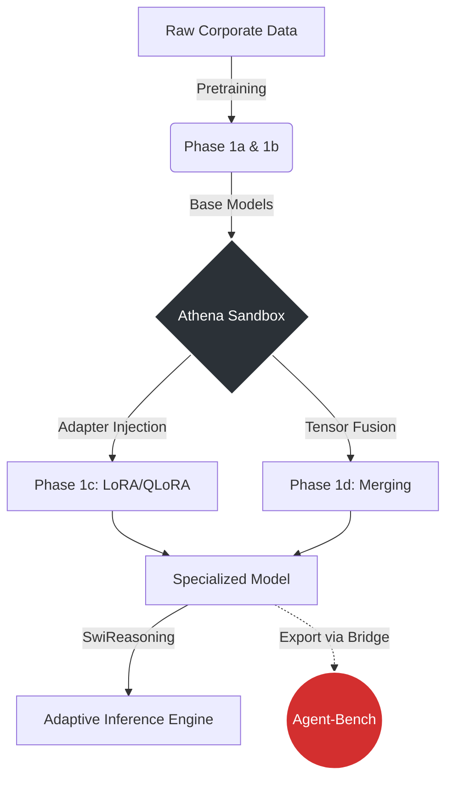

<div align="center">
  <h1>🧠 Athena Reasoning Sandbox</h1>
  <p><b>Scientific Framework for Neural Model Experimentation</b></p>
  <p>
    
    
    
    
  </p>
</div>

---

> [!NOTE]
> This repository implements the core **model development and training** pipelines for our corporate AI strategy. All model evaluation and grading is delegated to the companion [Agent-Bench](https://github.com/vfcarida/Agent-Bench) repository.

## 🌟 Strategic Overview

Athena Reasoning Sandbox is a research-grade Python framework designed for the full lifecycle of language model specialization. It addresses the critical "Build vs. Buy" corporate dilemma by providing highly efficient paths to create sovereign, domain-specific AI models that keep proprietary data strictly internal.

We implement the four essential pathways of model specialization:

| Phase | Methodology | Target Use Case | Module |
|-------|-------------|-----------------|---------|
| **1a** | **From-Scratch Pretraining** | Extreme data sovereignty & novel vocabularies | `src/pretraining/from_scratch.py` |
| **1b** | **Continued Pretraining** | Deep domain adaptation of open weights | `src/pretraining/continued_pretraining.py` |
| **1c** | **SFT & PEFT (LoRA/QLoRA)** | Instruction following & style alignment | `src/finetuning/` |
| **1d** | **Merging & SwiReasoning** | Multi-skill fusion & entropy-guided inference | `src/merging/`, `src/reasoning/` |

---

## 🏗️ Architecture & Data Flow



### Directory Structure
```text
Athena-reasoning-sandbox/
├── configs/                   # YAML configs for all training pipelines
├── src/
│   ├── main.py                # 🚀 Orchestrator (Demo all pathways)
│   ├── pretraining/           # 🧬 From-scratch & continued pretraining (AMP, RoPE)
│   ├── finetuning/            # 🛠️ SFT, LoRA adapters, 4-bit quantization
│   ├── merging/               # 🔗 SLERP, TIES, DARE tensor operations
│   ├── reasoning/             # 🤔 SwiReasoning entropy simulator
│   ├── bridge/                # 🌉 Agent-Bench evaluation connector
│   └── utils/                 # 📊 Mathematical metrics (Shannon entropy, Elo)
└── tests/                     # 🧪 Unit test suite
```

---

## 🚀 Installation & Quick Start

1. **Clone & Environment Setup**
```bash
git clone https://github.com/vfcarida/Athena-reasoning-sandbox.git
cd Athena-reasoning-sandbox

python -m venv .venv
# Activate: `.venv\Scripts\activate` (Win) or `source .venv/bin/activate` (Mac/Linux)
```

2. **Install Dependencies**
```bash
pip install -r requirements.txt

# [Optional] For QLoRA 4-bit fine-tuning (Requires NVIDIA GPU)
pip install bitsandbytes>=0.41.0

# [Optional] For full evaluation integration
pip install -e ../Agent-Bench
```

3. **Run the Sandbox Demo**
Execute the main orchestrator to see all 4 pathways simulated:
```bash
python -m src.main
```

---

## 🔬 Mathematical Foundations

> [!TIP]
> **Why we use these algorithms:**
> Understanding the math allows us to push boundaries beyond basic API calls.

### 1. LoRA (Low-Rank Adaptation)
Instead of updating the massive weight matrix $W$, LoRA freezes $W$ and trains a low-rank decomposition $A$ and $B$:
$$W' = W + \frac{\alpha}{r} (B \cdot A)$$
Where $A \in \mathbb{R}^{d \times r}$ and $B \in \mathbb{R}^{r \times d}$, with $r \ll d$.

### 2. SLERP (Spherical Linear Interpolation)
Unlike simple averaging, SLERP preserves the angular geometric properties of parameter vectors during model merging:
$$\text{Slerp}(p_0, p_1; t) = \frac{\sin((1-t)\theta)}{\sin\theta} p_0 + \frac{\sin(t\theta)}{\sin\theta} p_1$$

### 3. SwiReasoning (Entropy-Guided)
The model calculates Shannon Entropy for its current prediction probability distribution $P(x)$:
$$H(X) = -\sum_{i=1}^{M} P(x_i) \log_2 P(x_i)$$
If $H(X) > \text{threshold}$, the model injects a `<think>` token to expand latent reasoning capacity before emitting the final answer.

---

## 🌉 Agent-Bench Integration

Models built in Athena are not graded here. They are exported via the `AgentBenchBridge` to be rigorously evaluated against semantic and functional benchmarks.

```python
from src.bridge.agent_bench_bridge import AgentBenchBridge

# 1. Initialize the bridge
bridge = AgentBenchBridge()

# 2. Export your newly trained model
bridge.export_for_evaluation(model, tokenizer, "./models/finance-specialist")

# 3. Trigger external evaluation suite
results = bridge.run_benchmark(suite_id="finance_reasoning_v1")
```

---
<div align="center">
  <i>Developed for Advanced Agentic Coding & MLOps Research</i>
</div>
