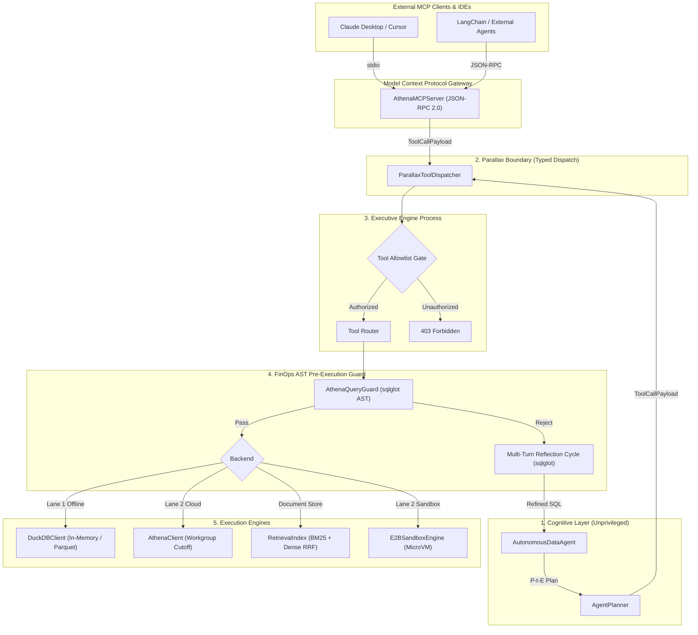

<div align="center">
  <h1>🧠 Athena Reasoning Sandbox</h1>
  <p><b>FinOps-Governed Autonomous Reasoning Agents & Cognitive-Executive Architecture</b></p>
  <p>
    <a href="https://github.com/vfcarida/Athena-reasoning-sandbox/actions"></a>
    <a href="tests/"></a>
    <a href="docs/BASELINE.md"></a>
    <a href="https://github.com/astral-sh/ruff"></a>
    <a href="http://mypy-lang.org/"></a>
    <a href="https://github.com/vfcarida/Athena-reasoning-sandbox/blob/main/LICENSE"></a>
    <a href="https://www.python.org/downloads/"></a>
  </p>
</div>

---

## 🌟 Executive Overview

**Athena Reasoning Sandbox** is an open-source research and engineering framework for **FinOps-governed autonomous reasoning agents**. It solves the critical safety and cost challenges of connecting Large Language Models (LLMs) to analytical data lakes and code execution engines.

By enforcing the **Parallax Principle** (strict Cognitive-Executive Separation), Athena isolates latent reasoning from privileged tool dispatch. Autonomous agents reason over query execution rejections via **multi-turn adaptive reflection**, self-correcting non-compliant SQL statements (omitted partitions, unbounded `SELECT *`, or missing limits) using compile-time AST transformations before executing against analytical backends.

---

## 🏗️ Core Architectural Pillars


```mermaid
graph TB
    subgraph Clients["External MCP Clients & IDEs"]
        Claude["Claude Desktop / Cursor"]
        CustomAgent["LangChain / External Agents"]
    end

    subgraph MCP["Model Context Protocol Gateway"]
        MCPServer["AthenaMCPServer (JSON-RPC 2.0)"]
        Claude -->|stdio| MCPServer
        CustomAgent -->|JSON-RPC| MCPServer
    end

    subgraph Cognitive["1. Cognitive Layer (Unprivileged)"]
        Agent["AutonomousDataAgent"]
        Planner["AgentPlanner"]
        Agent -->|P-t-E Plan| Planner
    end

    subgraph Boundary["2. Parallax Boundary (Typed Dispatch)"]
        Dispatcher["ParallaxToolDispatcher"]
        Planner -->|ToolCallPayload| Dispatcher
        MCPServer -->|ToolCallPayload| Dispatcher
    end

    subgraph Executive["3. Executive Engine Process"]
        Allowlist{"Tool Allowlist Gate"}
        Dispatcher --> Allowlist
        Allowlist -->|Authorized| Router["Tool Router"]
        Allowlist -->|Unauthorized| Reject["403 Forbidden"]
    end

    subgraph Governance["4. FinOps AST Pre-Execution Guard"]
        Guard["AthenaQueryGuard (sqlglot AST)"]
        Router --> Guard
        Guard -->|Pass| ExecEngine{"Backend"}
        Guard -->|Reject| Reflection["Multi-Turn Reflection Cycle (sqlglot)"]
        Reflection -->|Refined SQL| Agent
    end

    subgraph Backends["5. Execution Engines"]
        ExecEngine -->|Lane 1 Offline| DuckDB["DuckDBClient (In-Memory / Parquet)"]
        ExecEngine -->|Lane 2 Cloud| Athena["AthenaClient (Workgroup Cutoff)"]
        ExecEngine -->|Document Store| RAG["RetrievalIndex (BM25 + Dense RRF)"]
        ExecEngine -->|Lane 2 Sandbox| E2B["E2BSandboxEngine (MicroVM)"]
    end
```

### 1. The Parallax Principle (Cognitive-Executive Separation)
- The reasoning loop (Cognitive Layer) runs unprivileged and can never directly invoke system commands, file systems, or network sockets.
- Tool invocations are serialized into immutable, typed `ToolCallPayload` schemas dispatched across an in-process boundary.
- The `ExecutiveEngineProcess` enforces a strict deny-by-default allowlist with hard execution timeouts.

### 2. FinOps AST Pre-Execution Governance
- Query generation is validated against an Abstract Syntax Tree (AST) powered by `sqlglot` prior to execution.
- **Partition Pruning Enforcement**: Prevents disastrous full-table scans ($5/TB scan risks on AWS Athena) by requiring partition filters in `WHERE` clauses.
- **Projection Bounding**: Strictly rejects unbounded wildcard queries (`SELECT *`), ensuring columnar efficiency.
- **Buffer Safety**: Enforces client row limits (`LIMIT`).
- **Cloud Budget Cutoffs**: Supports AWS Athena WorkGroup `BytesScannedCutoffPerQuery` and active byte-scanning cancellation.

### 3. Multi-Turn Adaptive Reflection with AST Rewriting
- When an analytical query is rejected by the AST guard, the `AutonomousDataAgent` does not fail terminals.
- The agent captures the AST error, appends a structured `<think>` reflection trace, autonomously repairs the SQL query via `sqlglot` AST transformations, and re-executes across the Parallax boundary.

### 4. Model Context Protocol (MCP) Standard Server
- Native JSON-RPC 2.0 MCP server adapter (`athena-agent --mcp`).
- Allows IDEs and external agent ecosystems (Claude Desktop, Cursor, LangChain MCP) to consume Athena tools over stdio with dynamic schema reflection.

### 5. Dual-Lane Engineering Architecture
| Feature | Lane 1 (Local / Offline) | Lane 2 (Cloud / Production) |
| :--- | :--- | :--- |
| **Execution Engine** | Local DuckDB (In-Memory / Parquet) | AWS Athena (CTAS + S3 Staging) |
| **AST FinOps Guard** | `AthenaQueryGuard` (`sqlglot`) | `AthenaQueryGuard` + `BytesScannedCutoffPerQuery` |
| **Code Sandboxing** | Local Subprocess (Isolation Refused by Default) | E2B Hardware MicroVMs |
| **Evaluation** | Deterministic Trajectory Metrics | DeepEval GEval LLM-as-a-Judge |
| **MCP Integration** | Standard JSON-RPC 2.0 Stdio Server | Standard JSON-RPC 2.0 Stdio Server |
| **Cost & Latency** | $0.00 / Sub-millisecond Execution | Cloud Pay-Per-Query / API Key Required |

---

## 🚀 Quick Start

### Installation

```bash
# Clone repository
git clone https://github.com/vfcarida/Athena-reasoning-sandbox.git
cd Athena-reasoning-sandbox

# Create and activate virtual environment
python -m venv .venv
# Windows PowerShell:
.\.venv\Scripts\Activate.ps1
# Linux / macOS:
source .venv/bin/activate

# Install core development dependencies & pre-commit hooks
pip install --upgrade pip
pip install -e ".[dev]"
pre-commit install
```

### Running Demonstrations & CLI

```bash
# Run all Tier-1 offline demonstrations:
athena-agent
# or: python -m src.main

# Run specific demo modules:
athena-agent --demo agent
athena-agent --demo retrieval
athena-agent --demo checkpoint
athena-agent --demo mcp

# Run as Model Context Protocol (MCP) stdio server for Claude Desktop / Cursor:
athena-agent --mcp
```

### Running Autonomous Multi-Turn Reflection

```python
import asyncio
from src.athena.duckdb_client import DuckDBClient
from src.engine.data_agent import AutonomousDataAgent

async def main():
    # 1. Initialize local DuckDB analytical client
    client = DuckDBClient(database=":memory:")
    client.con.execute("""
        CREATE TABLE sales (
            order_id INTEGER,
            customer_id VARCHAR,
            amount DOUBLE,
            dt VARCHAR
        );
        INSERT INTO sales VALUES
            (1, 'cust_101', 99.5, '2026-09-01'),
            (2, 'cust_102', 150.0, '2026-09-01');
    """)

    # 2. Instantiate AutonomousDataAgent with multi-turn reflection
    agent = AutonomousDataAgent(
        backend="duckdb",
        duckdb_client=client,
        max_reflection_turns=3,
    )

    # 3. Submit an unpartitioned query that violates FinOps policy
    unpartitioned_sql = "SELECT order_id, amount FROM sales LIMIT 10;"

    summary = await agent.run(
        goal="Retrieve sales order amounts",
        initial_sql=unpartitioned_sql,
        required_partition_keys=["dt"],
    )

    print(f"Success: {summary.success}")
    print(f"Turns taken: {summary.turns}")
    print(f"Final SQL: {summary.final_sql}")
    print(f"Rows: {summary.result_data.get('rows')}")

if __name__ == "__main__":
    asyncio.run(main())
```

Output:
```text
Success: True
Turns taken: 2
Final SQL: SELECT order_id, amount FROM sales WHERE dt = '2026-09-01' LIMIT 10
Rows: [[1, 99.5], [2, 150.0]]
```

---

## 💻 Directory Structure

```text
Athena-reasoning-sandbox/
├── .github/
│   ├── workflows/ci.yml       # Automated CI Quality Gate (Ruff, Bandit, MyPy, Pytest)
│   └── pull_request_template.md # Standardized PR review checklist
├── .pre-commit-config.yaml    # Git pre-commit quality gate hooks
├── configs/                   # System configurations
├── docs/
│   ├── index.md               # Documentation portal landing page
│   ├── architecture/overview.md # Detailed architectural design documentation
│   ├── guides/quickstart.md   # Practical step-by-step developer tutorial
│   ├── BASELINE.md            # Audit benchmarks and verification logs
│   └── MERGING.md             # Model merge pipeline documentation
├── evals/                     # Agentic evaluation suite
│   ├── metrics/               # Deterministic trajectory scoring metrics
│   └── test_agent_trajectory.py # Trajectory evaluation tests
├── mkdocs.yml                 # MkDocs-Material static site configuration
├── src/
│   ├── athena/                # Analytical query engines & AST governance
│   │   ├── athena_client.py   # AWS Athena boto3 client with workgroups & cancellation
│   │   ├── duckdb_client.py   # Local DuckDB engine with AST query governance
│   │   └── query_guard.py     # sqlglot AST FinOps query validator
│   ├── engine/                # Executive engine & Parallax boundary
│   │   ├── agent_loop.py      # Plan-then-Execute orchestration loop
│   │   ├── data_agent.py      # AutonomousDataAgent with multi-turn reflection
│   │   ├── dispatcher.py      # ParallaxToolDispatcher typed boundary
│   │   ├── executor.py        # ExecutiveEngineProcess with tool allowlist
│   │   ├── grpc_boundary.py   # Backwards-compatible deprecation shim
│   │   └── mcp_server.py      # Model Context Protocol (MCP) JSON-RPC 2.0 stdio server
│   ├── rag/                   # Hybrid retrieval engine
│   │   ├── hybrid_search.py   # Lexical BM25 + dense embedding RRF
│   │   └── retrieval_index.py # Document store with JSON-safe operations
│   ├── reasoning/             # Structured reasoning schemas & entropy simulation
│   │   ├── schemas.py         # Type-safe Pydantic models (Plan, Step, Observation)
│   │   └── swi_reasoning.py   # Shannon entropy-guided simulation loop
│   ├── sandbox/               # Sandboxed code execution
│   │   └── e2b_sandbox.py     # E2B microVM runner (refuses unisolated local fallback)
│   ├── state/                 # Conversation state & effect idempotency
│   │   └── checkpoint_manager.py # JSON checkpoint serializer with SHA-256 effect ledger
│   ├── telemetry/             # OpenTelemetry distributed tracing & GenAI spans
│   │   └── tracer.py          # OTel tracer with GenAI semantic conventions
│   └── utils/                 # Configuration and metric utilities
└── tests/                     # 178+ deterministic unit & integration tests
```

---

## 🔬 Quality Gates & Local Verification

Before committing or opening a Pull Request, run the local quality gate suite:

```bash
# 1. Run Ruff linter and formatter checks
ruff check src evals tests

# 2. Run static type checking with MyPy
mypy src/engine src/athena src/state src/sandbox src/rag src/telemetry

# 3. Run Bandit security audit
bandit -r src/ -x tests/ -s B105,B106,B615 -ll

# 4. Run Lane-1 test suite with coverage report
pytest -m "not e2b and not network" -v --cov=src --cov-report=term-missing

# 5. Run git pre-commit checks across all files
pre-commit run --all-files
```

---

## 📄 Open Source Governance

- **Contributing**: Please review [CONTRIBUTING.md](CONTRIBUTING.md) for contribution workflows, code standards, and PR guidelines.
- **Code of Conduct**: This project adheres to the [Contributor Covenant v2.1](CODE_OF_CONDUCT.md).
- **Security Policy**: For vulnerability disclosures, please review [SECURITY.md](SECURITY.md).
- **License**: Distributed under the [MIT License](LICENSE).
