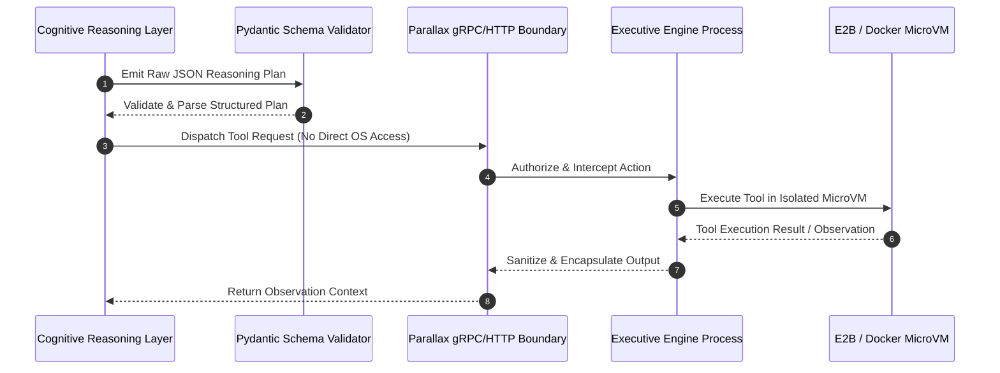
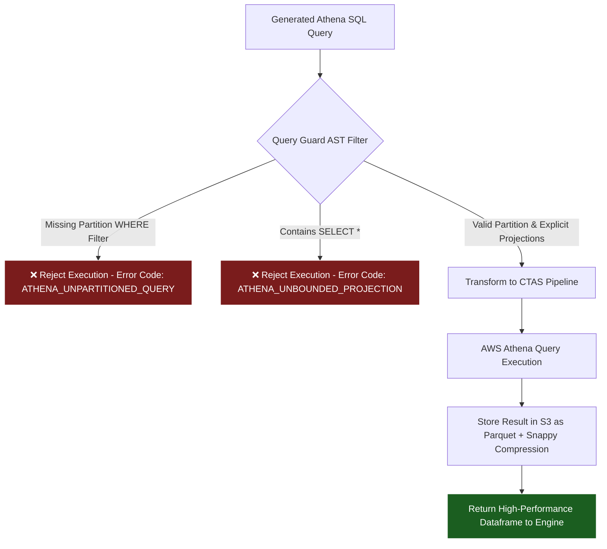

<div align="center">
  <h1>🧠 Athena Reasoning Sandbox</h1>
  <p><b>Enterprise-Grade Agentic Reasoning, Parallax Cognitive-Executive Separation & AWS Athena Cost Optimization Framework</b></p>
  <p>
    <a href="https://github.com/vfcarida/Athena-reasoning-sandbox/actions"></a>
    <a href="https://codecov.io/gh/vfcarida/Athena-reasoning-sandbox"></a>
    <a href="https://github.com/vfcarida/Athena-reasoning-sandbox/blob/main/LICENSE"></a>
    <a href="https://www.python.org/downloads/"></a>
    <a href="https://confident-ai.com"></a>
  </p>
</div>

---

## 🌟 Overview & System Ambition

**Athena Reasoning Sandbox** is a high-performance, cloud-native scientific framework designed for state-of-the-art Large Language Model (LLM) agentic reasoning, enterprise specialization, and cloud-scale data engineering. 

Modern agentic deployments often suffer from structural vulnerabilities—including unsafe shell execution by reasoning components, exorbitant cloud query costs ($5/TB runaway AWS Athena scans), and non-deterministic trajectory failures. Athena addresses these challenges by introducing:

1. **Cognitive-Executive Separation (Parallax Principle)**: Restricts LLM reasoning processes from direct OS interaction by enforcing an isolated gRPC/HTTP interface boundary to an engine process/microVM sandbox.
2. **Plan-then-Execute (P-t-E) Paradigm**: Structured output validation (Pydantic) guaranteeing deterministic agent plan generation prior to executive action.
3. **AWS Athena FinOps Query Guards**: Algorithmic AST pre-execution parsing that enforces partition key filtering, explicit column selection, and automatic conversion to Snappy-compressed Apache Parquet/ORC via CTAS pipelines.
4. **Trajectory Observability & DeepEval Suite**: Comprehensive LLM-as-a-Judge evaluations (`PlanQualityMetric`, `PlanAdherenceMetric`, `ToolCorrectnessMetric`, `TaskCompletionMetric`) paired with OpenTelemetry distributed tracing across the full `Prompt → Think → Plan → Tool Call → Observation` loop.

---

## 🏗️ Technical Architecture

### 1. Plan-then-Execute (P-t-E) & Parallax Boundary


```mermaid
sequenceDiagram
    autonumber
    participant LLM as Cognitive Reasoning Layer
    participant Guard as Pydantic Schema Validator
    participant API as Parallax gRPC/HTTP Boundary
    participant Executive as Executive Engine Process
    participant Sandbox as E2B / Docker MicroVM

    LLM->>Guard: Emit Raw JSON Reasoning Plan
    Guard-->>LLM: Validate & Parse Structured Plan
    LLM->>API: Dispatch Tool Request (No Direct OS Access)
    API->>Executive: Authorize & Intercept Action
    Executive->>Sandbox: Execute Tool in Isolated MicroVM
    Sandbox-->>Executive: Tool Execution Result / Observation
    Executive-->>API: Sanitize & Encapsulate Output
    API-->>LLM: Return Observation Context
```

### 2. AWS Athena FinOps Cost Guard & CTAS Ingestion Engine


```mermaid
flowchart TD
    SQL[Generated Athena SQL Query] --> Guard{Query Guard AST Filter}
    
    Guard -->|Missing Partition WHERE Filter| Reject1[❌ Reject Execution - Error Code: ATHENA_UNPARTITIONED_QUERY]
    Guard -->|Contains SELECT *| Reject2[❌ Reject Execution - Error Code: ATHENA_UNBOUNDED_PROJECTION]
    
    Guard -->|Valid Partition & Explicit Projections| CTAS[Transform to CTAS Pipeline]
    
    CTAS --> Athena[AWS Athena Query Execution]
    Athena --> S3[Store Result in S3 as Parquet + Snappy Compression]
    S3 --> Result[Return High-Performance Dataframe to Engine]

    style Reject1 fill:#7a1c1c,stroke:#fff,color:#fff
    style Reject2 fill:#7a1c1c,stroke:#fff,color:#fff
    style Result fill:#1b5e20,stroke:#fff,color:#fff
```

---

## 💻 Directory Structure

```text
Athena-reasoning-sandbox/
├── .github/
│   └── workflows/
│       └── ci.yml             # CI/CD pipeline (Ruff, Bandit, Pytest 90%+, DeepEval >= 0.75)
├── configs/                   # Production YAML configurations
├── evals/                     # DeepEval trajectory evaluation suite
│   ├── test_trajectory_eval.py# Custom metrics (PlanQuality, PlanAdherence, ToolCorrectness)
│   └── metrics/               # Algorithmic evaluation scoring DAGs
├── src/
│   ├── main.py                # System entry point and demonstration orchestrator
│   ├── athena/                # AWS Athena query guards, CTAS pipelines, cost optimization
│   │   ├── athena_client.py   # High-performance boto3 Athena wrapper with CTAS
│   │   └── query_guard.py     # AST SQL parser enforcing partition filters & explicit projections
│   ├── bridge/                # Agent-Bench evaluation bridge connector
│   ├── engine/                # Executive engine process & gRPC Parallax boundary
│   │   ├── executor.py        # Executive tool processor
│   │   └── grpc_boundary.py   # Cognitive-Executive isolated boundary
│   ├── finetuning/            # SFT, LoRA, and QLoRA 4-bit quantization adapters
│   ├── merging/               # Tensor fusion operators (SLERP, TIES, DARE)
│   ├── RAG/                   # BM25 + ADA-002 Hybrid Search & RAG evaluation metrics
│   │   └── hybrid_search.py   # Reciprocal Rank Fusion (RRF) search engine
│   ├── reasoning/             # SwiReasoning entropy simulator & Pydantic output schemas
│   │   ├── schemas.py         # Type-safe structured output validation
│   │   └── swi_reasoning.py   # Real-time Shannon entropy-guided inference loop
│   ├── sandbox/               # E2B SDK & Docker MicroVM execution isolation
│   │   └── e2b_sandbox.py     # Resource-quota controlled microVM sandbox
│   ├── state/                 # DeltaState / Crab Checkpoint & Restore (C/R) interface
│   │   └── checkpoint.py      # Conversation turn & OS state serializer
│   ├── telemetry/             # OpenTelemetry distributed tracing & telemetry
│   │   └── tracer.py          # Trace span builder for agentic loops
│   └── utils/                 # Mathematical metrics, config, & environment verification
└── tests/                     # Deterministic unit test suite (>90% target coverage)
```

---

## 🚀 Quick Start & Installation

### 1. Requirements & Prerequisites
- Python 3.11+
- Docker Engine / Docker Desktop (optional, for containerized sandbox execution)
- AWS Credentials (optional, for Athena cloud data operations)

### 2. Environment Setup

```bash
# Clone repository
git clone https://github.com/vfcarida/Athena-reasoning-sandbox.git
cd Athena-reasoning-sandbox

# Create and activate virtual environment
python -m venv .venv
# On Windows PowerShell:
.\.venv\Scripts\Activate.ps1
# On Linux/macOS:
source .venv/bin/activate

# Upgrade pip and install core dependencies
pip install --upgrade pip
pip install -r requirements.txt
```

### 3. Environment Configuration

Create a `.env` file in the project root:

```env
AWS_ACCESS_KEY_ID=your_access_key_id
AWS_SECRET_ACCESS_KEY=your_secret_access_key
AWS_REGION=us-east-1
ATHENA_S3_STAGING_DIR=s3://your-athena-query-results-bucket/
E2B_API_KEY=your_e2b_api_key
OTEL_EXPORTER_OTLP_ENDPOINT=http://localhost:4317
```

### 4. Running the Main Orchestrator Demo

```bash
python -m src.main
```

---

## 🔬 Evaluation & Testing Suite

Athena implements a rigorous Test-Driven Development (TDD) evaluation framework powered by **DeepEval** and **Pytest**.

### Running Unit Tests & Coverage
```bash
# Execute deterministic unit tests with strict coverage checks
pytest tests/ -v --cov=src --cov-report=term-missing --cov-fail-under=90
```

### Running DeepEval Agentic Trajectory Evaluation
```bash
# Execute DeepEval trajectory evaluation suite
deepeval test run evals/test_trajectory_eval.py
```

---

## 📄 License & Attribution

Distributed under the MIT License. See `LICENSE` for details.

Developed for Advanced Agentic Coding, Enterprise LLM Engineering, and MLOps Research.
