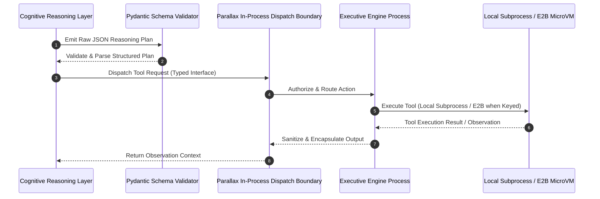
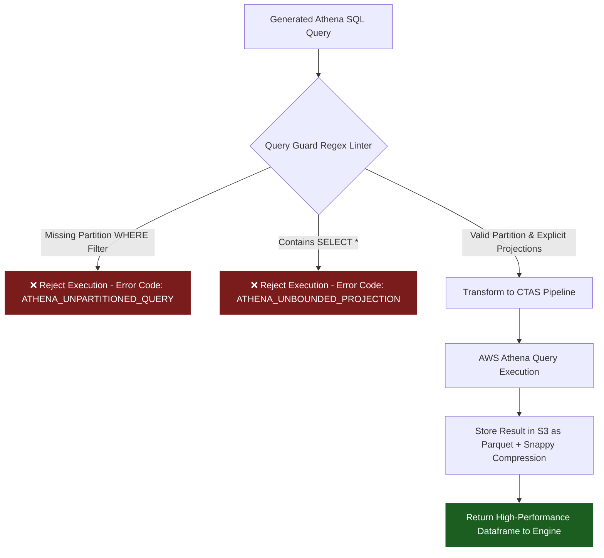

<div align="center">
  <h1>🧠 Athena Reasoning Sandbox</h1>
  <p><b>Scientific Neural Model Experimentation Toolkit & Experimental Agentic Infrastructure</b></p>
  <p>
    <a href="https://github.com/vfcarida/Athena-reasoning-sandbox/actions"></a>
    <a href="docs/BASELINE.md"></a>
    <a href="https://github.com/vfcarida/Athena-reasoning-sandbox/blob/main/LICENSE"></a>
    <a href="https://www.python.org/downloads/"></a>
    <a href="evals/test_agent_trajectory.py"></a>
  </p>
</div>

> [!NOTE]
> **Repository Status**: This repository contains (1) a working small-scale model-development toolkit (pretraining, LoRA/QLoRA config, SLERP/TIES/DARE merging) and (2) experimental, unintegrated agentic-infrastructure modules (engine, sandbox, athena, state, rag, telemetry) that are not wired into any end-to-end agent loop at this revision.

---

## 🌟 Overview & System Ambition

**Athena Reasoning Sandbox** is a scientific framework comprising two distinct layers:
1. **Working Model-Development Toolkit**: Validated, runnable pipelines for from-scratch and continued pretraining, LoRA/QLoRA parameter-efficient fine-tuning configuration, and mathematical model merging operators (SLERP, TIES-Merging, DARE).
2. **Experimental Agentic Infrastructure (Unintegrated Prototypes)**: Standalone modules exploring cognitive-executive separation, query guards, sandboxing, and evaluation patterns that are currently isolated components rather than an end-to-end autonomous agent loop.

The repository investigates solutions to common agentic design challenges:

1. **Cognitive-Executive Separation (Parallax Principle)**: Restricts LLM reasoning processes from direct OS interaction using an in-process typed dispatch interface (mocked/planned for remote API boundaries).
2. **Plan-then-Execute (P-t-E) Paradigm**: Structured output validation (Pydantic) guaranteeing deterministic agent plan schemas prior to executive action.
3. **AWS Athena FinOps Query Guards**: Regex linter that enforces partition key filtering, explicit column selection, and provides CTAS query rewriting for Snappy-compressed Apache Parquet/ORC.
4. **Trajectory Observability & Evaluation**: Deterministic keyword heuristics (`PlanQualityMetric`, `PlanAdherenceMetric`, `ToolCorrectnessMetric`, `TaskCompletionMetric`) paired with OpenTelemetry span tracing prototypes.

---

## 🏗️ Technical Architecture

### 1. Plan-then-Execute (P-t-E) & Parallax Boundary


```mermaid
sequenceDiagram
    autonumber
    participant LLM as Cognitive Reasoning Layer
    participant Guard as Pydantic Schema Validator
    participant API as Parallax In-Process Dispatch Boundary
    participant Executive as Executive Engine Process
    participant Sandbox as Local Subprocess / E2B MicroVM

    LLM->>Guard: Emit Raw JSON Reasoning Plan
    Guard-->>LLM: Validate & Parse Structured Plan
    LLM->>API: Dispatch Tool Request (Typed Interface)
    API->>Executive: Authorize & Route Action
    Executive->>Sandbox: Execute Tool (Local Subprocess / E2B when Keyed)
    Sandbox-->>Executive: Tool Execution Result / Observation
    Executive-->>API: Sanitize & Encapsulate Output
    API-->>LLM: Return Observation Context
```

### 2. AWS Athena FinOps Cost Guard & CTAS Ingestion Engine


```mermaid
flowchart TD
    SQL[Generated Athena SQL Query] --> Guard{Query Guard Regex Linter}
    
    Guard -->|Missing Partition WHERE Filter| Reject1[❌ Reject Execution - Error Code: ATHENA_UNPARTITIONED_QUERY]
    Guard -->|Contains SELECT *| Reject2[❌ Reject Execution - Error Code: ATHENA_UNBOUNDED_PROJECTION]
    
    Guard -->|Valid Partition & Explicit Projections| CTAS[Transform to CTAS Pipeline]
    
    CTAS --> Athena[AWS Athena Query Execution]
    Athena --> S3[Store Result in S3 as Parquet + Snappy Compression]
    S3 --> Result[Return High-Performance Dataframe to Engine]

    style Reject1 fill:#7a1c1c,stroke:#fff,color:#fff
    style Reject2 fill:#7a1c1c,stroke:#fff,color:#fff
    style Result fill:#1b5e20,stroke:#fff,color:#fff
```

---

## 💻 Directory Structure

```text
Athena-reasoning-sandbox/
├── .github/
│   └── workflows/
│       └── ci.yml             # CI/CD pipeline (Ruff, Bandit, Pytest, DeepEval) [Unverified gate]
├── configs/                   # Production YAML configurations
├── evals/                     # Trajectory evaluation suite
│   ├── test_agent_trajectory.py# Custom metrics (PlanQuality, PlanAdherence, ToolCorrectness)
│   └── metrics/               # Deterministic keyword evaluation scoring heuristics
├── src/
│   ├── main.py                # System entry point and demonstration orchestrator
│   ├── athena/                # AWS Athena query guards, CTAS pipelines, cost optimization
│   │   ├── athena_client.py   # High-performance boto3 Athena wrapper with CTAS
│   │   └── query_guard.py     # Regex linter enforcing partition filters & explicit projections
│   ├── bridge/                # Agent-Bench evaluation bridge connector
│   ├── engine/                # Executive engine process & in-process typed dispatch
│   │   ├── executor.py        # Executive tool processor
│   │   └── grpc_boundary.py   # In-process typed dispatch boundary (mocked remote API)
│   ├── finetuning/            # SFT, LoRA, and QLoRA 4-bit quantization adapters
│   ├── merging/               # Tensor fusion operators (SLERP, TIES, DARE)
│   ├── rag/                   # BM25 + ADA-002 Hybrid Search & RAG evaluation metrics
│   │   └── hybrid_search.py   # Reciprocal Rank Fusion (RRF) search engine
│   ├── reasoning/             # SwiReasoning entropy simulator & Pydantic output schemas
│   │   ├── schemas.py         # Type-safe structured output validation
│   │   └── swi_reasoning.py   # Shannon entropy-guided simulation loop
│   ├── sandbox/               # Sandbox execution engine
│   │   └── e2b_sandbox.py     # Timeout-only local subprocess execution (microVM via E2B when keyed)
│   ├── state/                 # Checkpoint & Restore (C/R) interface
│   │   └── checkpoint_manager.py # Conversation JSON checkpoint & restore serializer
│   ├── telemetry/             # OpenTelemetry distributed tracing & telemetry prototypes
│   │   └── tracer.py          # Trace span builder for agentic loops
│   └── utils/                 # Mathematical metrics, config, & environment verification
└── tests/                     # Deterministic unit test suite (Lane 1 green; 39% baseline coverage)
```

---

## 🚀 Quick Start & Installation

### 1. Requirements & Prerequisites
- Python 3.10+ (tested on Python 3.12)
- E2B API Key (optional, for remote microVM sandbox execution; defaults to local subprocess)
- AWS Credentials (optional, for Athena cloud data operations; dry-run available)

### 2. Environment Setup

```bash
# Clone repository
git clone https://github.com/vfcarida/Athena-reasoning-sandbox.git
cd Athena-reasoning-sandbox

# Create and activate virtual environment
python -m venv .venv
# On Windows PowerShell:
.\.venv\Scripts\Activate.ps1
# On Linux/macOS:
source .venv/bin/activate

# Upgrade pip and install Lane-1 dependencies (offline/torch-free)
pip install --upgrade pip
pip install pytest pytest-cov pytest-asyncio ruff bandit mypy pydantic pydantic-settings types-PyYAML pyyaml rich tqdm deepeval boto3 numpy

# For full ML stack (requires heavy PyTorch ~2GB download):
# pip install -r requirements.txt
```

### 3. Environment Configuration

Create a `.env` file in the project root (optional for offline testing):

```env
AWS_ACCESS_KEY_ID=your_access_key_id
AWS_SECRET_ACCESS_KEY=your_secret_access_key
AWS_REGION=us-east-1
ATHENA_S3_STAGING_DIR=s3://your-athena-query-results-bucket/
E2B_API_KEY=your_e2b_api_key
OTEL_EXPORTER_OTLP_ENDPOINT=http://localhost:4317
```

### 4. Running the Main Orchestrator Demo

```bash
python -m src.main
```
*(Note: Runs standalone demonstrations of model fine-tuning, merging, and reasoning; does not invoke an integrated autonomous agent loop.)*

---

## 🔬 Evaluation & Testing Suite

Athena includes unit test suites and trajectory evaluation scripts.

### Running Unit Tests (Lane 1 — Offline / Torch-Free)
```bash
# Run lightweight offline test suite (28 tests, verified green)
pytest -m "not heavy" -q --cov=src --cov-report=term-missing
```
*(Note: Baseline coverage is **39%** as measured in `docs/BASELINE.md`. The CI badge claim of `--cov-fail-under=90` is unverified and unachieved at this revision.)*

### Running Heavy Tests (Lane 2 — PyTorch Required)
```bash
# Run heavy tests requiring PyTorch / ML dependencies
pytest -m "heavy" -v
```

### Running DeepEval Agentic Trajectory Evaluation
```bash
# Execute DeepEval trajectory evaluation suite
deepeval test run evals/test_agent_trajectory.py
```

---

## 📄 License & Attribution

Distributed under the MIT License. See `LICENSE` for details.

Developed for Advanced Agentic Coding, Enterprise LLM Engineering, and MLOps Research.
