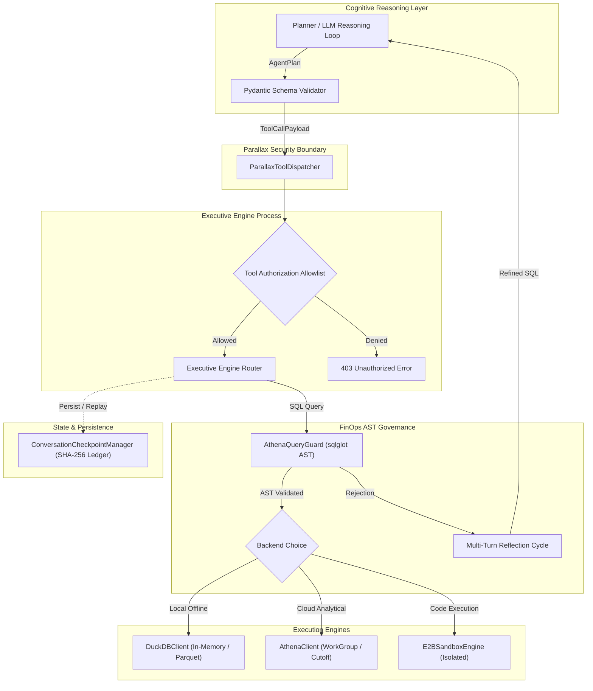

# Architecture Overview

Athena Reasoning Sandbox provides an enterprise-grade, FinOps-governed autonomous reasoning architecture designed for safe data analytics.

---

## 1. Cognitive-Executive Separation (The Parallax Principle)

In conventional agent architectures, the LLM reasoning process frequently executes tools with arbitrary host privileges, risking accidental command execution, resource exhaustion, or credential leakage.

Athena enforces strict **Cognitive-Executive Separation**:
- **Cognitive Layer**: Responsible strictly for planning, reasoning (<think> traces), and output formulation. It operates in an unprivileged runtime and cannot execute arbitrary OS calls.
- **Parallax Dispatcher**: Receives typed, frozen `ToolCallPayload` objects and dispatches them across an in-process or HTTP boundary.
- **Executive Engine**: Enforces an explicit, deny-by-default allowlist (`authorized_tools`), executes verified actions with hard timeouts, and returns structured `ObservationPayload` objects.

---

## 2. FinOps AST Pre-Execution Governance

Analytical data lakes (AWS Athena, BigQuery, Snowflake) incur substantial financial costs when queries execute full table scans ($5/TB scan pricing in Athena).

The `AthenaQueryGuard` uses `sqlglot` to parse generated SQL queries into an Abstract Syntax Tree (AST):
1. **Partition Pruning Verification**: Walks `sqlglot.expressions.Where` nodes to guarantee partition key predicates (e.g. `dt = '...'`) are present as conjunctions. Rejects unpartitioned scans with `UnpartitionedQueryError`.
2. **Unbounded Projection Rejection**: Disallows wildcard column selections (`SELECT *`), enforcing explicit column projection to optimize columnar reads.
3. **Implicit/Explicit Row Limits**: Requires an explicit `LIMIT` clause to protect client memory buffers from unexpected result sizes.
4. **AWS WorkGroup Cutoff**: Sets `BytesScannedCutoffPerQuery` on AWS Athena workgroups and polls `DataScannedInBytes` with auto-cancellation if query bounds are exceeded.

---

## 3. Multi-Turn Adaptive Reflection

When an agent proposes an analytical query that fails FinOps governance, the `AutonomousDataAgent` does not abort or execute blindly. Instead, it enters an internal reflection cycle:
- Parses the rejection error (e.g., missing partition or unbounded projection).
- Synthesizes a structured reflection thought (`<think> Reflection: ... </think>`).
- Programmatically repairs the query by injecting partition filters, restricting column projections, or appending limits.
- Resubmits the repaired query up to `max_reflection_turns`.

---

## 4. Conversation State Checkpointing & Idempotency

Agent loops that encounter transient network failures or retries risk re-executing non-idempotent operations. Athena features `ConversationCheckpointManager`:
- **State Snapshotting**: Captures conversation history, tool memory, and turn sequences in JSON.
- **Deterministic Keying**: Uses `compute_idempotency_key(action_type, tool_name, tool_args)` via SHA-256 to record side effects.
- **Replay Protection**: When re-running plans, previously recorded side effects are retrieved from the effect ledger rather than re-dispatched.
