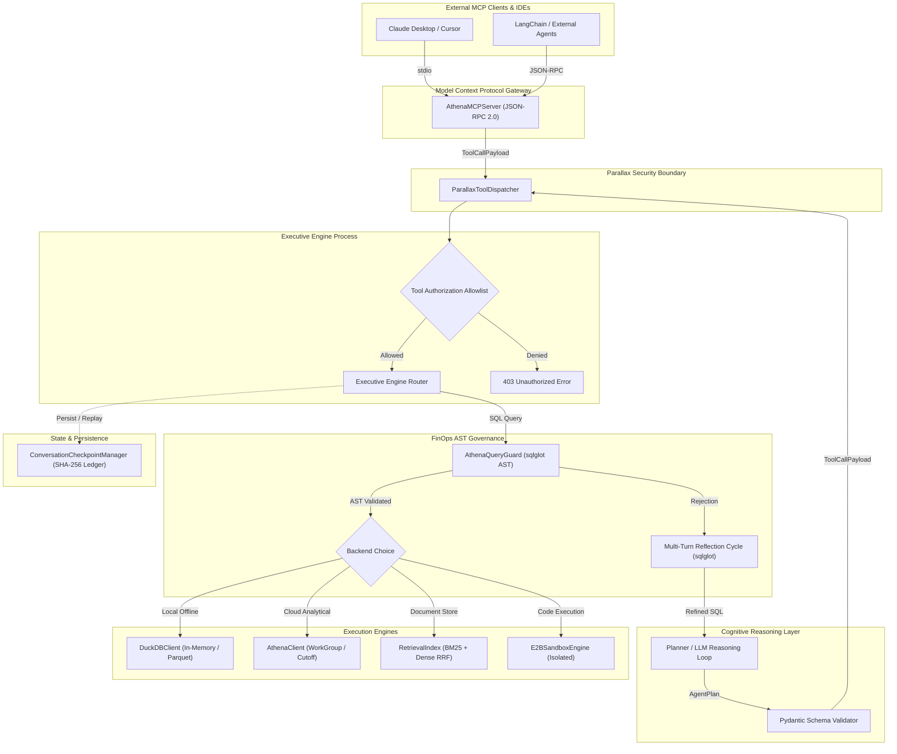
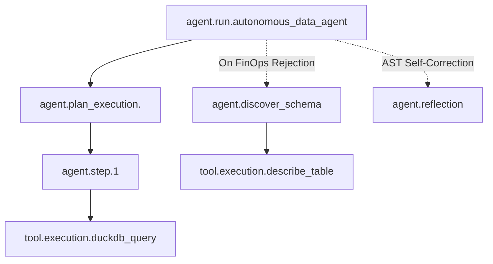

# Architecture Overview

Athena Reasoning Sandbox provides an enterprise-grade, FinOps-governed autonomous reasoning architecture designed for safe data analytics.

```mermaid
graph TB
    subgraph Clients["External MCP Clients & IDEs"]
        Claude["Claude Desktop / Cursor"]
        CustomAgent["LangChain / External Agents"]
    end

    subgraph MCP["Model Context Protocol Gateway"]
        MCPServer["AthenaMCPServer (JSON-RPC 2.0)"]
        Claude -->|stdio| MCPServer
        CustomAgent -->|JSON-RPC| MCPServer
    end

    subgraph CognitiveLayer["Cognitive Reasoning Layer"]
        LLM["Planner / LLM Reasoning Loop"]
        Schema["Pydantic Schema Validator"]
        LLM -->|AgentPlan| Schema
    end

    subgraph Boundary["Parallax Security Boundary"]
        Dispatcher["ParallaxToolDispatcher"]
        Schema -->|ToolCallPayload| Dispatcher
        MCPServer -->|ToolCallPayload| Dispatcher
    end

    subgraph ExecutiveLayer["Executive Engine Process"]
        Auth{"Tool Authorization Allowlist"}
        Dispatcher --> Auth
        Auth -->|Allowed| Router["Executive Engine Router"]
        Auth -->|Denied| Denied["403 Unauthorized Error"]
    end

    subgraph Governance["FinOps AST Governance"]
        Guard["AthenaQueryGuard (sqlglot AST)"]
        Router -->|SQL Query| Guard
        Guard -->|AST Validated| EngineChoice{"Backend Choice"}
        Guard -->|Rejection| Reflection["Multi-Turn Reflection Cycle (sqlglot)"]
        Reflection -->|Refined SQL| LLM
    end

    subgraph ExecutionBackends["Execution Engines"]
        EngineChoice -->|Local Offline| DuckDB["DuckDBClient (In-Memory / Parquet)"]
        EngineChoice -->|Cloud Analytical| Athena["AthenaClient (WorkGroup / Cutoff)"]
        EngineChoice -->|Document Store| RAG["RetrievalIndex (BM25 + Dense RRF)"]
        EngineChoice -->|Code Execution| Sandbox["E2BSandboxEngine (Isolated)"]
    end

    subgraph State["State & Persistence"]
        Ledger["ConversationCheckpointManager (SHA-256 Ledger)"]
        Router -.->|Persist / Replay| Ledger
    end
```

---

## 1. Cognitive-Executive Separation (The Parallax Principle)

In conventional agent architectures, the LLM reasoning process frequently executes tools with arbitrary host privileges, risking accidental command execution, resource exhaustion, or credential leakage.

Athena enforces strict **Cognitive-Executive Separation**:
- **Cognitive Layer**: Responsible strictly for planning, reasoning (`<think>` traces), and output formulation. It operates in an unprivileged runtime and cannot execute arbitrary OS calls.
- **Parallax Dispatcher**: Receives typed, frozen `ToolCallPayload` objects and dispatches them across an in-process or HTTP boundary.
- **Executive Engine**: Enforces an explicit, deny-by-default allowlist (`authorized_tools`), executes verified actions with hard timeouts, and returns structured `ObservationPayload` objects.

---

## 2. FinOps AST Pre-Execution Governance

Analytical data lakes (AWS Athena, BigQuery, Snowflake) incur substantial financial costs when queries execute full table scans ($5/TB scan pricing in Athena).

The `AthenaQueryGuard` uses `sqlglot` to parse generated SQL queries into an Abstract Syntax Tree (AST):
1. **Partition Pruning Verification**: Walks `sqlglot.expressions.Where` nodes to guarantee partition key predicates (e.g. `dt = '...'`) are present as conjunctions. Rejects unpartitioned scans with `UnpartitionedQueryError`.
2. **Unbounded Projection Rejection**: Disallows wildcard column selections (`SELECT *`), enforcing explicit column projection to optimize columnar reads.
3. **Implicit/Explicit Row Limits**: Requires an explicit `LIMIT` clause to protect client memory buffers from unexpected result sizes.
4. **Metadata & Introspection Bypass**: Intelligently identifies schema discovery statements (`SHOW TABLES`, `SHOW COLUMNS`, `DESCRIBE <table>`, `EXPLAIN ...`) and parameter-free queries (`SELECT 1`), safely exempting them from partition requirements while maintaining SQL validity.
5. **Pre-Execution Cost Estimation**: Uses `estimate_query_cost` with dataset statistics (total bytes, total columns, partition column) to calculate estimated scan volume and projected USD cost ($5.00/TB AWS Athena baseline) prior to dispatch.
6. **Multi-Dialect Support**: Validates and rewrites queries across `trino` (AWS Athena engine) and `duckdb` dialects.
7. **AWS WorkGroup Cutoff**: Sets `BytesScannedCutoffPerQuery` on AWS Athena workgroups and polls `DataScannedInBytes` with auto-cancellation if query bounds are exceeded.

---

## 3. Multi-Turn Adaptive Reflection with AST Rewriting

When an agent proposes an analytical query that fails FinOps governance, the `AutonomousDataAgent` does not abort or execute blindly. Instead, it enters an internal reflection cycle:
- Parses the rejection error (e.g., missing partition or unbounded projection).
- Synthesizes a structured reflection thought (`<think> Reflection: ... </think>`).
- Performs **AST-driven SQL rewriting** using `sqlglot` transformations:
  - Synthesizes and appends partition equality predicates (`dt = '2026-09-01'`) into existing or newly synthesized `WHERE` clauses.
  - Replaces `exp.Star` wildcard nodes with bounded, explicit column projections (`order_id, amount`).
  - Appends bounded `LIMIT 100` clauses.
- Resubmits the repaired query up to `max_reflection_turns`.

---

## 4. Model Context Protocol (MCP) Integration

Athena includes a native **Model Context Protocol (MCP)** server adapter (`AthenaMCPServer`) compliant with JSON-RPC 2.0:
- Exposes registered tools (`duckdb_query`, `athena_query`, `describe_table`, `retrieval_search`, `sandbox_execute`, `ping`, `echo`) with JSON Schema reflection.
- Operates over stdio via `athena-agent --mcp`, allowing instant connectivity from IDEs and external agents (Claude Desktop, Cursor, LangChain).
- Respects the Executive deny-by-default authorization allowlist, ensuring external callers cannot invoke unauthorized system actions.

---

## 5. Conversation State Checkpointing & Idempotency

Agent loops that encounter transient network failures or retries risk re-executing non-idempotent operations. Athena features `ConversationCheckpointManager`:
- **State Snapshotting**: Captures conversation history, tool memory, and turn sequences in JSON.
- **Deterministic Keying**: Uses `compute_idempotency_key(action_type, tool_name, tool_args)` via SHA-256 to record side effects.
- **Replay Protection**: When re-running plans, previously recorded side effects are retrieved from the effect ledger rather than re-dispatched.

---

## 6. Dual-Lane Evaluation Gate & Trajectory Metrics

To ensure robust evaluation in CI without incurring unexpected API bills or network flakiness, Athena provides a strict **Dual-Lane Evaluation Framework**:
- **Lane 1 (Offline Deterministic Heuristics)**:
  - `DeterministicTrajectoryHeuristic`: Rule- and keyword-based composite scoring of plan structure, tool correctness across the 7 authorized tools, plan adherence, and task completion.
  - `DeterministicRAGGate`: Rule-based evaluation of context relevancy, rank-weighted context precision (MAP / Precision@k), and grounded output faithfulness.
  - Executes 100% offline in CI without requiring API keys or GPU compute.
- **Lane 2 (Neural LLM-as-a-Judge)**:
  - `RealGEvalTrajectoryJudge`: DeepEval GEval evaluator using real neural LLMs (e.g. `gpt-4o-mini`) for holistic trajectory evaluation.
  - Gated behind `@pytest.mark.heavy` and explicit `OPENAI_API_KEY` verification.

---

## 7. OpenTelemetry Distributed Tracing & GenAI Semantic Conventions

Athena instruments the entire reasoning, reflection, and execution hierarchy with OpenTelemetry spans adhering to OpenTelemetry GenAI Semantic Conventions (v1.28+):

```mermaid
graph TD
    A["agent.run.autonomous_data_agent"] --> B["agent.plan_execution.<plan_id>"]
    B --> C["agent.step.1"]
    C --> D["tool.execution.duckdb_query"]
    A -.->|On FinOps Rejection| E["agent.discover_schema"]
    E --> F["tool.execution.describe_table"]
    A -.->|AST Self-Correction| G["agent.reflection"]
```

- **Root Agent Span (`agent.run.autonomous_data_agent`)**: Tracks `gen_ai.agent.name`, `gen_ai.agent.goal`, `gen_ai.agent.backend`, turns taken, reflection count, and final executed SQL.
- **Plan & Step Spans (`agent.plan_execution`, `agent.step.<N>`)**: Captures cognitive plan ID, step rationale, action type, and idempotency cache hit status (`gen_ai.step.replayed`).
- **Cognitive Reflection Spans (`agent.reflection`, `agent.discover_schema`)**: Tracks AST self-correction reasoning, rejected error message, and dynamic table schema discovery.
- **Tool Spans (`tool.execution.<tool_name>`)**: Captures tool parameters, duration, timeout limits, and failure statuses (`unregistered`, `unauthorized`, `timeout`, `error`).
- **In-Memory & Production Tracing**: Seamlessly switches between `InMemorySpanExporter` for testing and OpenTelemetry OTLP exporters in production.

